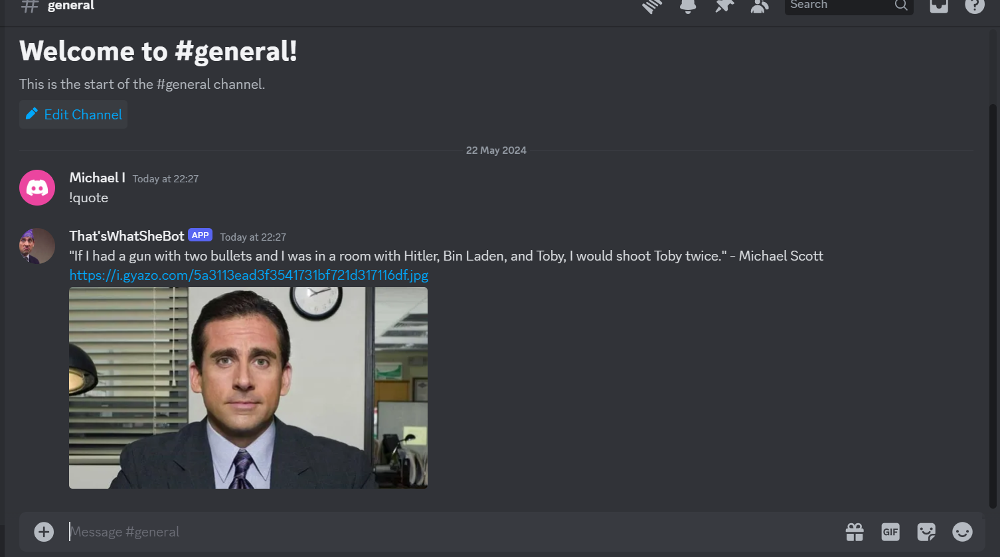

<pre>
████████╗██╗  ██╗ █████╗ ████████╗███████╗██╗    ██╗██╗  ██╗ █████╗ ████████╗
╚══██╔══╝██║  ██║██╔══██╗╚══██╔══╝██╔════╝██║    ██║██║  ██║██╔══██╗╚══██╔══╝
   ██║   ███████║███████║   ██║   ███████╗██║ █╗ ██║███████║███████║   ██║   
   ██║   ██╔══██║██╔══██║   ██║   ╚════██║██║███╗██║██╔══██║██╔══██║   ██║   
   ██║   ██║  ██║██║  ██║   ██║   ███████║╚███╔███╔╝██║  ██║██║  ██║   ██║   
   ╚═╝   ╚═╝  ╚═╝╚═╝  ╚═╝   ╚═╝   ╚══════╝ ╚══╝╚══╝ ╚═╝  ╚═╝╚═╝  ╚═╝   ╚═╝   
                                                                             
███████╗██╗  ██╗███████╗██████╗  ██████╗ ████████╗                           
██╔════╝██║  ██║██╔════╝██╔══██╗██╔═══██╗╚══██╔══╝                           
███████╗███████║█████╗  ██████╔╝██║   ██║   ██║                              
╚════██║██╔══██║██╔══╝  ██╔══██╗██║   ██║   ██║                              
███████║██║  ██║███████╗██████╔╝╚██████╔╝   ██║                              
╚══════╝╚═╝  ╚═╝╚══════╝╚═════╝  ╚═════╝    ╚═╝                           
                                                                             
</pre>


## Table of Contents

- [Installation](#installation)
- [Configuration](#configuration)
- [Running the Bot](#running-the-bot)
- [Development Setup](#development-setup)
- [Meta](#meta)
- [TODO](#todo)


## Installation

First, clone the repository:

```sh
git clone https://github.com/Ibinola/your-repo-name.git
cd your-repo-name
```
Then install necessary packages

```sh
pip install discord requests python-dotenv
```

### Configuration
Create a .env file in the project directory and add your Discord bot token:

```sh
TOKEN=your_discord_bot_token
```


### Bot in action



### Running the bot

```sh
python bot.py
```

## Development setup

Clone this repo and install packages

```sh
git clone https://github.com/Ibinola/your-repo-name.git
cd your-repo-name
pip install -r requirements.txt

```

## Meta

Michael Ibinola – ibinolamichael1@gmail.com

Distributed under the MIT license. See `LICENSE` for more information.

[https://github.com/Ibinola/](https://github.com/Ibinola/)

## TODO:

- [ ] Host somewhere
- [ ] explore more features?
- [x] add slash command
- [ ] handle errors properly
- [ ] write tests
